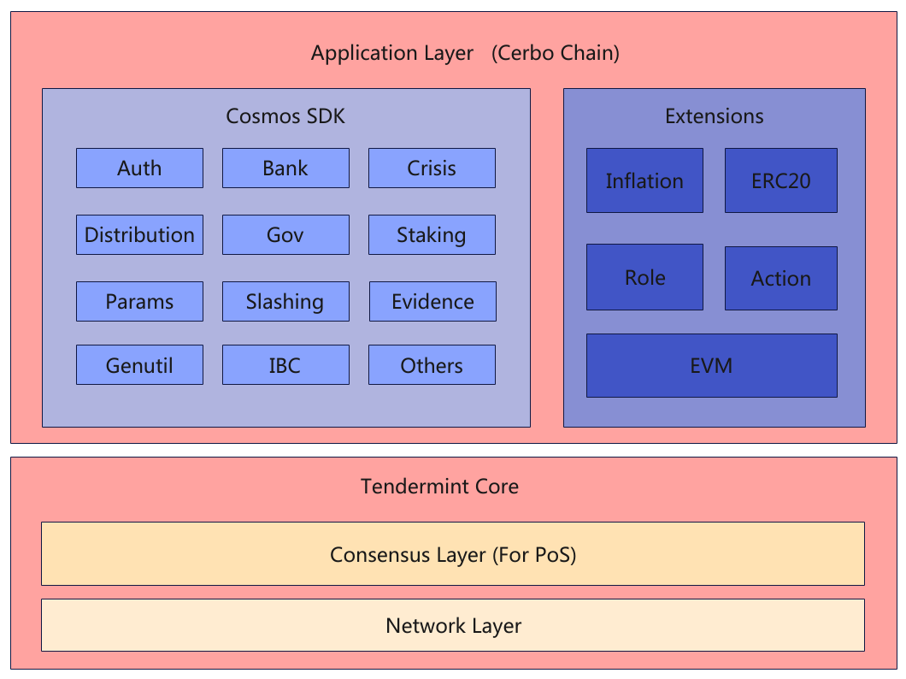
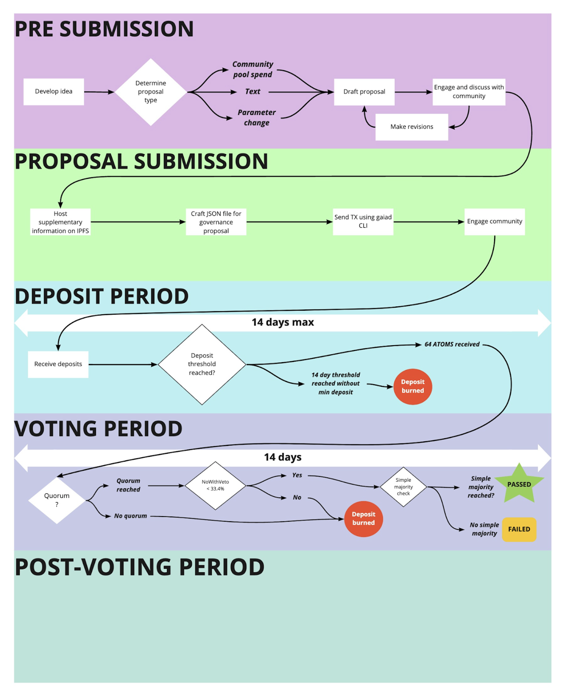

# **基于角色的访问控制 Role Based Access Control**
Language: [[English]](../chain/FLBRoleDesign.md) [[中文]](./FLBRoleDesign-cn.md)

**概览**

访问控制——即“谁被允许做这件事”——在构建我们的生态系统重非常重要。比如访问控制可能会控制谁可以给用户记录分数。访问控制最常见和基本的形式是所有权(ownership)的概念：在系统中有一个帐户为`owner` ，可以对其执行管理任务。

虽然所有权的简单性对于简单的系统或快速原型设计很有用，但通常需要不同级别的授权。比如一个帐户可以禁止用户访问系统，但不能创建新的令牌。基于角色的访问控制 (RBAC)在这方面提供了灵活性。

本质上，我们将定义多个角色，每个角色都允许执行不同的操作集，而不是到处都是`onlyOwner` 。 

我们通过投票治理的方式，根据实际的业务场景来管理这些角色，具体的信息在投票治理小节中进行说明。

**角色**

在我们的生态系统中存在如下四种角色：

- Uploader 数据上传者。负责将相关数据上传到区块链系统中供模型进行训练
- Verifier 数据验证者
    - 职责：验证者负责检查参与者上传的参数是否符合质量要求，并对这些参数进行独立验证
    - 功能：
    - 验证贡献：验证者评估参与者的贡献，判断其是否有效（例如，是否提升了全局模型的性能）。
- Challenger 挑战者。为了防止Uploader上传无效的数据，挑战者会对Uploader上传的数据进行验证。
    - 职责：挑战者可以对验证者已通过的参与者贡献提出质疑，并进行独立验证。如果挑战成功，挑战者获得奖励，参与者受罚
- Finalizer 裁决者。对挑战者挑战的结果进行最终裁决。

## 实现

对于定义的每个角色类型Uploader，Verifier，Challenger，Finalizer。我们定义一个Role类型的变量，该变量使用map保存具有该角色的帐户列表。

相关伪代码如下所示：

```go
enum RoleType (
  Uploader = keeack256("UPLOADER");
  Verifier = keeack256("VERIFIER");
  Challenger = keeack256("CHALLENGER");
  Finalizer = keeack256("FINALIZER");
)

struct Role {
	hasRole map[address]bool;
}

roles := map[RoleType]Role

func HasRole(RoleType roleType, address account) (bool) {
    return roles[roleType].hasRole[account];
}

func GrantRole(RoleType roleType, address account) {
    roles[roleType].hasRole[account] = true;
}

func RevokeRole(RoleType roleType, address account) {
    roles[roleType].hasRole[account] = false;
}
```

从上面的设计中我们可以看出，一个账户其实可以具有多个角色。这种灵活性，可以在在实际中应用：比如某些业务中需要某个账户有多个角色才能成功。

**角色授予/撤销**

我们可以有一个Owner的角色，用于授予以及撤销上面的相关角色。但是这样带来中心化的危险。一旦Owner的私钥泄露或者丢失，则会对整个系统的损害带来不可估量的影响。所以我们可以借助cosmos的gov模块，用发起提案的形式授予/撤销角色，达到去中心化的目标。

以授予/撤销一个Uploader角色为例，相关伪代码如下：

```go
// GrantUploader defines a method for grant a new uploader
func (k msgServer) GrantUploader(ctx context.Context, msg *types.MsgGrantUploader) (*types.MsgGrantUploaderResponse, error) {
	signer := msg.GetSigner()
	if !signer.Equals(k.accountKeeper.GetModuleAddress(govtypes.ModuleName)) {
		return nil, types.ErrSignerNotGovModule
	} else {
		GrantRole(RoleTypeUploader, msg.uploader);
		k.bankKeeper.SendCoinsFromAccountToModule(ctx, msg.uploader, types.ModuleName, coins)
	}
}

// RevokeUploader defines a method for revoke a uploader
func (k msgServer) RevokeUploader(ctx context.Context, msg *types.MsgRevokeUploader) (*types.MsgRevokeUploaderResponse, error) {
	signer := msg.GetSigner()
	if !signer.Equals(k.accountKeeper.GetModuleAddress(govtypes.ModuleName)) {
		return nil, types.ErrSignerNotGovModule
	} else {
		RevokeRole(RoleTypeUploader, msg.uploader);
		k.bankKeeper.SendCoinsFromModuleToAccount(ctx, types.ModuleName, msg.uploader, coins)
	}
}
```

为了防止Uploader恶意上传无效的数据。在授予某个账号 Uploader 角色的时候，我们需要将该账号的一些token转移到模块账户中进行质押。一旦某个 Challenger 角色对数据挑战成功。则需要扣除 Uploader 质押的部分token用于奖励 Challenger。一旦质押的token全部扣除完毕，系统自动剥夺该用户的 Uploader 角色。此时该用户需要补足系统规定的最少质押数量的token才能恢复其 Uploader 角色。

同理，如果撤销了某个用户的 Uploader 角色，我们需要将系统中用户质押的token返回给用户。

**调用**

- **内部模块调用**

role为基础模块。构建此模块的作用是提供给其他模块调用做相关的权限管理控制。整个功能的实现基本在Keeper中完成。`Keeper`指的是 Cosmos SDK 抽象，其作用是管理对各个模块定义的状态子集的访问。 `Keeper`是特定于模块的，即模块定义的状态子集只能由该模块中定义的`keeper`访问。假设AI模块需要访问Role模块定义的状态子集，则需要将对Role模块的内部`keeper`引用传递给第AI模块。AI相关伪代码如下

```go
// RoleKeeper defines the expected interface needed to check account role.
type RoleKeeper interface {
	func HasRole(RoleType roleType, address account) (bool)
}

// UploadData defines a method a uploader updalod data
func (k msgServer) UploadData(ctx context.Context, msg *types.MsgUploadData) (*types.MsgUploadDataResponse, error) {
	signer := msg.GetSigner()
	if !k.roleKeeper.HasRole(signer) {
		return nil, types.ErrSignerNotHasUploaderRole
	} else {
		SaveData(msg.data);
	}
}
```

- **智能合约调用**

由于我们的链支持solidity合约，为了扩充使用场景，能够让solidity合约也具有访问go实现的role模块。我们可以将role模块使用预编译合约实现。假设我们实现的预编译合约地址为：
`0x0000000000000000000000000000000000006000`

下面是一个合约如何调用该预编译合约访问底层Role模块的使用示例：
```solidity
pragma solidity ^0.8.0;

/// @dev The IRole contract's address.
address constant ROLE_PRECOMPILE_ADDRESS = 0x0000000000000000000000000000000000006000;

/// @dev The IRole contract's instance.
IRole constant ROLE_CONTRACT = IRole(ROLE_PRECOMPILE_ADDRESS);

interface IRole {
    /**
     * @dev Returns `true` if `account` has been granted `role`.
     */
    function hasRole(bytes32 role, address account) external returns (bool);
}

contract RoleTest {
    function testHasRole(bytes32 role, address account) public returns (bool) {
        return ROLE_CONTRACT.hasRole(role, account);
    }
}
```

## Cerbo Chain架构设计



Cerbo Chain的整体结构，分为两个主要层次：底层的Tendermint Core和上层的应用层（Application Layer），具体细节如下：

**1. Tendermint Core**

- **共识层（Consensus Layer）**：负责实现权益证明（Proof of Stake, PoS）共识机制，确保网络中节点达成一致，保证交易的安全性和顺序性。
- **网络层（Network Layer）**：负责节点之间的通信，确保数据在网络中有效传输。这一层提供了点对点的网络协议，支持消息的广播和同步。

**2. 应用层（Application Layer）**

- **Cosmos SDK**：这是Cerbo Chain的核心框架，提供了构建区块链应用的基础模块。具体模块包括：
  - **Auth**：负责链上账户管理，支持账户的创建、更新、删除等操作。
  - **Bank**：管理资产的转移。
  - **Crisis**：链上状态的一致性检查。
  - **Distribution**：管理奖励和分配机制。
  - **Gov**：治理模块，允许社区参与决策。
  - **Staking**：处理质押和验证者的管理。
  - **Params**：管理链的参数设置。
  - **Slashing**：验证者被动作恶管理。
  - **Evidence**：验证者主动作恶管理。
  - **Genutil**：生成创世区块的工具。
  - **IBC（Inter-Blockchain Communication）**：支持跨链通信，允许不同区块链之间进行交互。
  - **Others**：其他可能的模块。
- **扩展模块（Extensions）**：这些模块提供了额外的功能，增强了Cerbo Chain的能力：
  - **Inflation**：管理通货膨胀和代币的发行。
  - **ERC20**：支持与以太坊ERC20代币标准的兼容。
  - **Role**：定义和管理链上不同的角色，包括Uploader、Verifier、Challenger和Finalizer。
  - **Action**：处理特定的操作。比如上传data、更新score等，这些操作是由Uploader这个角色来完成的。
  - **EVM（Ethereum Virtual Machine）**：允许在Cerbo Chain上运行以太坊智能合约，增强了与以太坊生态系统的兼容性。

## **Cerbo Chain 的投票治理**

在 Cerbo Chain 社区，任何人都可以提交提案。提交后，社区会遵循严格的治理流程来决定该提案是否实施。

1. **存款阶段**

一个提案在提出后，需要在两周内获得至少 512（暂定） 个 CBO 的资金存入。由于社区里的任何一个人都可以提交提案，因此 512 个 CBO 是提案进入投票阶段的最低门槛，用以剔除无成本的垃圾提案。

2. **投票阶段**

达到最低存款额 512 个 CBO 后，提案将进入为期两周的投票阶段。所有代币质押者都有投票权：「赞同」、「反对」、「强烈反对」、「弃权」。

注意：验证人可以代表质押代币给他们的委托人投票，但当委托人自行投票时，将覆盖验证人的投票结果。

3. **清点投票结果**

提案需要同时满足以下三个条件才能进入实施阶段

1. 两周后，系统中质押的代币有 40％ 以上参与了该提案投票
2. 参与投票的代币占比（剔除“弃权”票）超过 50％ 投了「赞同」
3. 参与投票的代币占比（剔除“弃权”票）少于 33.4% 投了「强烈反对」

以上三个条件，有一个不满足，该提议就会被拒绝，且存入的资金将不予退还，而是存入社区池。

4. **实施提案**

社区通过投票决定接受该提案后，将进入提案执行阶段。

