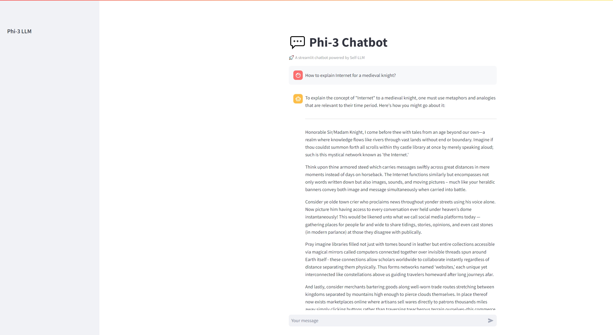
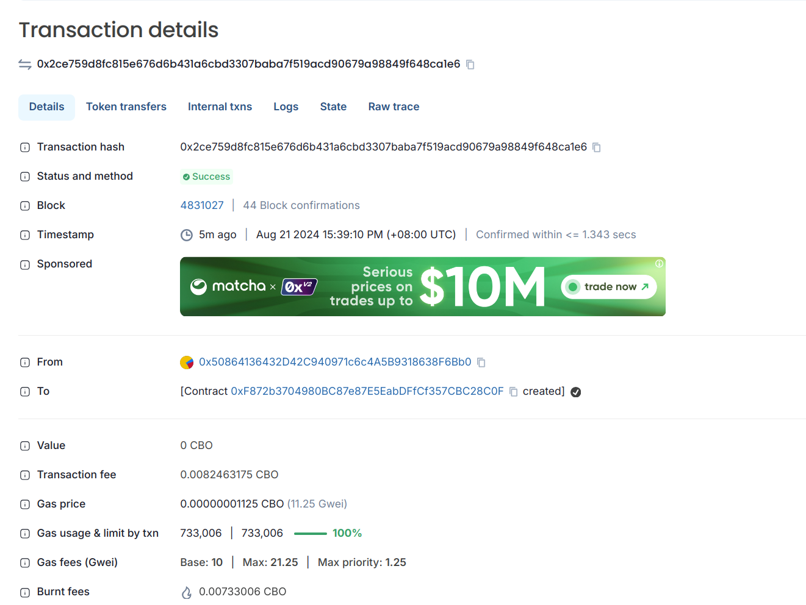

# FLB - 联邦学习与区块链集成项目

Language: [[English]](README.md) [[中文]](docs/README-cn.md)

## 介绍

本项目旨在将联邦学习 (FL) 与区块链技术相结合，增强机器学习应用中的数据隐私和安全性。联邦学习支持在持有本地数据样本的去中心化设备之间训练全局模型，而无需交换它们。通过结合区块链，我们可以确保联邦学习过程的环境不可篡改、透明且安全。

## 环境设置
克隆项目，准备本地环境：
```
conda create -n flb python=3.11
conda activate flb
pip install -r requirements.txt
```

## 设置配置文件
在我们初始的**config.yaml**文件中，你需要设置你的**模型路径**和**数据集名称**。

```
model:
model_path: # Hugging face中的模型路径或本地模型路径
quantization: 8 #如果你想使用cpu，请将其设置为null
device_map: "cuda" #支持cuda、cpu和mps

dataset_name： # Hugging face中的数据集或本地数据集路径
```
## 本地联邦学习微调

**效率**：我们考虑对本地客户端使用参数高效微调技术，例如LoRA。

运行以下命令来启动本地联邦学习微调测试：

```
python main_fl_socket.py
```
客户端默认使用[本地差分隐私](https://en.wikipedia.org/wiki/Local_differential_privacy)，可以在`config.yaml`中将client模块中的**local_dp**设置为**False**来关闭本地差分隐私。

如果你想在服务器端使用差分隐私，可以在`config.yaml`中将client模块中的**local_dp**设置为**False**并运行：
```
python main_fl_socket.py --use_server_dp=true
```

我们还支持使用 [gRPC](https://grpc.io/) 进行客户端和服务器通信，你可以运行以下脚本：

```
python main_fl_grpc.py
```

如果你想在服务器端使用差分隐私，可以在 `config.yaml` 中将client模块中的 **local_dp** 设置为 **False** 并运行：
```
python main_fl_grpc.py --use_server_dp=true
```

> 我们支持创建不安全和安全的 gRPC 通道，你可以将本地 [根证书](https://en.wikipedia.org/wiki/Root_certificate) 设置到 config.yaml 中以使用安全通道进行通信：
> ```
> client：
>   grpc_insecure: True # 设置该值为False来关闭此功能，并设置 grpc_auth_cer_path 以使用安全的 gRPC 通道
>   grpc_auth_cer_path: null # 将本地证书路径设置到此处
> ```

可以通过修改 [proto 文件](https://protobuf.dev/getting-started/pythontutorial/) `utils/protos/communicate.proto` 来生成你自己的消息结构和通信功能。

现在在服务器端`server/strategy/`下只有两种策略，我们将来会添加更多。
- [x] Federate average（服务器端默认策略）
> 中央服务器通过平均模型参数来聚合从客户端收到的模型。
- [x] Federate average + differential privacy with fixed clipping
> 在实施差分隐私时，通常需要处理数据以降低敏感度。固定裁剪就是这样一种方法。是指在对数据进行进一步分析之前，按照预先设定的阈值对其进行裁剪或者限制，这样做的目的是控制数据的范围，从而减少个别极值对最终结果的影响，保证算法的输出不对任何个体的隐私构成风险。
- [ ] Federate average + differential privacy with adaptive clipping
> 与固定裁剪不同，自适应裁剪并不预先设定固定的裁剪阈值，而是根据数据的实际分布和所需的隐私保护等级，动态调整阈值。
- [ ] ...

### 评估
您可以使用 `utils/eval_from_local.py` 作为脚本来评估模型。
```
cd utils
python eval_from_local.py
```
可以通过设置参数来自定义脚本，使用 -h 运行脚本以查看每个参数描述：
```commandline
python eval_from_local.py -h

usage: eval_from_local.py [-h] [--ntrain NTRAIN] [--selected_subjects SELECTED_SUBJECTS] [--save_dir SAVE_DIR] [--lora_config_path LORA_CONFIG_PATH]
                          [--lora_weights_path LORA_WEIGHTS_PATH] [--global_record_file GLOBAL_RECORD_FILE] [--model MODEL]

options:
  -h, --help            show this help message and exit
  --ntrain NTRAIN, -k NTRAIN
                        few-shot examples amount, default is 3
  --selected_subjects SELECTED_SUBJECTS, -sub SELECTED_SUBJECTS
                        selected subjects: biology, business, chemistry, computer science, economics, engineering, health, history, law, math, philosophy, physics, psychology, other,
                        all. default is 'all'
  --save_dir SAVE_DIR, -s SAVE_DIR
                        evaluation results save dir, default is 'eval_results'
  --lora_config_path LORA_CONFIG_PATH, -lc LORA_CONFIG_PATH
                        lora config folder path
  --lora_weights_path LORA_WEIGHTS_PATH, -lw LORA_WEIGHTS_PATH
                        lora weights bin file path
  --global_record_file GLOBAL_RECORD_FILE, -grf GLOBAL_RECORD_FILE
                        global log record file, default is 'eval_record_collection.csv'
  --model MODEL, -m MODEL
                        local model path
```
我们使用 [TIGER-Lab/MMLU-Pro](https://huggingface.co/datasets/TIGER-Lab/MMLU-Pro) 作为我们的数据集进行评估。

我们同样也在服务端使用了evaluation `server/server.py`：
```python
def eval(self, lora_config_path='', model_weights_path='', clients_data_detail=None):
    results = eval_model(self.config_detail.model.model_path, lora_config_path, model_weights_path, n_train=1)
    result_save_path = os.path.join(self.output, self.latest_version)
    with open(result_save_path + '/eval_result.json', 'w') as f:
        json.dump(results, f)
    print(f'Eval results: {results}')
    # calculate and send reward to each client address
    if self.use_chain is True:
        self.calculate_reward(clients_data_detail)

def update(self, do_eval=True):
    """Aggregate model and save new model weight, send reward to each client"""
    clients_detail, dataset_length_list, path_list = get_clients_uploads_after(self.save_path, self.latest_version)
    client_list = clients_detail.keys()
    if len(client_list) > 0:
        self.aggregate(clients_detail.keys(), dataset_length_list, path_list)
        self.save_model()
        if do_eval:
            weight_saved_path = os.path.join(self.output, self.latest_version, 'adapter_model.bin')
            eval_thread = Thread(target=self.eval,
                                 args=['./output',
                                       weight_saved_path,
                                       clients_detail])
            eval_thread.start()
    else:
        logging.info('No new weights from client')
```

####  测试本地服务端模型评估并保存最新权重文件 <a id="server_side_weight_save"></a>
你可以运行 `run_fast_api.py` 并请求接口 `POST /update_wight` 来给当前模型进行聚合后的评估。它会自动聚合并保存一个新的模型权重文件到你的本地文件夹“server_output” <a id="server_side_weight_save"></a>:
```commandline
python run_fast_api.py

curl -X 'POST' \
  'http://127.0.0.1:8080/update_wight' \
  -H 'accept: application/json' \
  -d ''
```

## 模型下载及模型更新

### 模型下载

将模型从huggingface下载到本地指定位置。
```python
from huggingface_hub import snapshot_download
snapshot_download(repo_id="microsoft/Phi-3-mini-4k-instruct",local_dir="./model", ignore_patterns=["*.gguf"])
```

### 本地SFT微调案例
```python
from transformers import AutoTokenizer, AutoModelForCausalLM, BitsAndBytesConfig
from peft import get_peft_model, LoraConfig,TaskType
from peft.utils import prepare_model_for_kbit_training
from trl import SFTConfig, SFTTrainer
import torch
from datasets import Dataset
import pandas as pd

model_path = "microsoft/Phi-3-mini-4k-instruct"
tokenizer = AutoTokenizer.from_pretrained(model_path, use_fast=False, padding_side="right")
tokenizer.pad_token = tokenizer.unk_token
tokenizer.model_max_length = 2048
tokenizer.pad_token_id = tokenizer.convert_tokens_to_ids(tokenizer.pad_token)

def apply_chat_template(
    example,
    tokenizer,
):
    messages = [
        {"role": "user", "content": example["instruction"]},
        {"role": "assistant", "content": example["output"]},
    ]
    example["text"] = tokenizer.apply_chat_template(
        messages, tokenize=False, add_generation_prompt=False
    )
    return example
processed_train_dataset = ds.map(
        apply_chat_template,
        fn_kwargs={"tokenizer": tokenizer},
        num_proc=10,
        remove_columns=ds.column_names,
        desc="Applying chat template to train_sft",
    )

model = model = AutoModelForCausalLM.from_pretrained(
        model_path,
        quantization_config=quantization_config,
        device_map="auto",
        trust_remote_code=True,
        torch_dtype=torch.bfloat16,
    )
config = LoraConfig(
    task_type=TaskType.CAUSAL_LM, 
    target_modules=["q_proj", "k_proj", "v_proj", "o_proj", "gate_proj", "up_proj", "down_proj"],
    inference_mode=False, 
    r=8, 
    lora_alpha=16, 
    lora_dropout=0.055,
    bias="none",
)
model = get_peft_model(model, config)
args=SFTConfig(
    output_dir="./output/Phi-3",
    per_device_train_batch_size=4,
    gradient_accumulation_steps=4,
    logging_steps=20,
    log_level="info",
    num_train_epochs=50,
    save_steps=100,
    learning_rate=1e-4,
    save_total_limit=2,
    gradient_checkpointing=True,
    dataset_text_field="text",
    max_seq_length=2048,
)
trainer = SFTTrainer(
            model=model,
            train_dataset=processed_train_dataset,
            tokenizer=tokenizer,
            args=args
        )
trainer.train()
lora_path='./Phi-3_lora'
trainer.model.save_pretrained(lora_path)
tokenizer.save_pretrained(lora_path)
```

待办事项

[]Q-LoRA  
[]Q-Bottleneck Adapters  
[]Q-PrefixTuning  

### 模型更新
```python
import torch 
from transformers import AutoModelForCausalLM, AutoTokenizer, pipeline 
import torch
from peft import (
    PeftModel,
    LoraConfig,
    get_peft_model,
    get_peft_model_state_dict,
    prepare_model_for_kbit_training,
    set_peft_model_state_dict,
)

torch.random.manual_seed(0) 
model = AutoModelForCausalLM.from_pretrained( 
    "./model_path",  
    device_map="cuda",  
    torch_dtype="auto",  
    trust_remote_code=True,  
)

tokenizer = AutoTokenizer.from_pretrained("./model_path")
lora_weights_path = "./model_path/output/0/adapter_model.bin"
lora_config_path = "./model_path/output"
config = LoraConfig.from_pretrained(lora_config_path)
lora_weights = torch.load(lora_weights_path)

# 加载lora权重
model = PeftModel(model, config)
set_peft_model_state_dict(model,lora_weights)

# 将lora权重与原模型进行合并.
model = model.merge_and_unload()
```

## 更多的开源模型微调集部署案例

[√] Phi-3  
[√] Lama3_1  
[√] Gemma2   
[ ] Mini-CPM  
[ ] Falcon  
[ ] Qwen2  
[ ] ChatGLM  

我们将逐渐提供更多的开源大模型的微调教程，简化开源大模型的部署、使用、应用流程。 

对于使用streamlit搭建的web demo，可以使用以下命令直接运行程序

```
streamlit run examples/xxx/xxx-web-demo.py --server.address 127.0.0.1 --server.port 8080
```

界面如下



你还可以尝试使用简单的脚本来获取服务端的最新权重文件，模拟测试本地模型的更新。
只需要运行 restful api 脚本，然后运行客户端脚本。

打开一个终端作为服务器端并运行：
```commandline
# 运行 api 脚本，以便客户端可以从服务器端获取模型权重文件
python run_fast_api.py
```

打开另一个终端作为客户端并运行：
```commandline
# 运行客户端脚本并将 local_update 设置为 True 以模拟本地模型的更新
python run_grpc_client.py --local_update true
```

> 确保服务器端已经聚合并[保存](#server_side_weight_save)一个新的权重文件。
>
> 你还可以手动将权重文件从服务器端复制到客户端。**你需要从服务器端同时复制版本文件夹和 bin 文件。**例如：
>
> ```
> - client
>   |_ weights_update
>       |_ 20240829_162336
>           |_ adapter_model.bin
> ```
>
> `config.yaml` 中的 **weight_file_download_path** 是保存服务器端模型权重的路径，如果你手动从服务器复制文件，请确保将权重文件放置到该路径下。
> ```
> 客户端：
> weight_file_download_path：“。/client/weights_update”
> auto_pull：True # 如果您想手动从服务器端复制权重文件，请将其设置为 False。如果为 False，请确保在客户端调用更新函数之前已将权重文件放在正确的位置。
>```

你可以到`client/client.py`查看更多细节：
```python
def update(self):
    if self.config_detail.client.auto_pull is True:
        try:
            url = f'{self.config_detail.server.restful_url}/latest_weight'
            response = requests.get(url, stream=True)
            response.raise_for_status()
            content_disposition = response.headers.get('Content-Disposition', '')
            filename = content_disposition.split('filename=')[-1]
            model_version = filename.split('-')[0]
            save_path = os.path.join(self.model_weights_download_path, model_version)
            os.makedirs(save_path, exist_ok=True)
            with open(save_path + '/adapter_model.bin', 'wb') as file:
                for chunk in response.iter_content(chunk_size=8192):
                    file.write(chunk)
            print(f"Saved in {save_path}")
        except requests.RequestException as e:
            print(f"Download weight file failed, please download manually. Error: {e}")
            raise requests.RequestException(f"Download weight file failed, please download manually. Error: {e}")

    lora_config_path = os.path.join(self.config_detail.sft.training_arguments.output_dir,
                                    'adapter_config.json')
    _, lora_weights_path_list = get_latest_folder(self.model_weights_download_path)
    if os.path.isfile(lora_config_path) and lora_weights_path_list:
        lora_weights_path = os.path.join(lora_weights_path_list[0],
                                         'adapter_model.bin')
        config = LoraConfig.from_pretrained(self.config_detail.sft.training_arguments.output_dir)
        lora_weights = torch.load(lora_weights_path)
        model = PeftModel(self.model, config)
        set_peft_model_state_dict(model, lora_weights)
        self.model = model
    else:
        print("No Lora config and weights found. Skipping update.")
```

## 支持区块链

为了满足公平性和安全性，我们设计了去中心化的链上分角色访问控制架构，不同的角色具有不同的权限和作用，以此来保证用户数据在链上的安全、不可篡改，相关的细节可以访问[FLBRoleDesign](./FLBRoleDesign-cn.md)文档。

**隐私**：我们在链上开发智能合约，以支持区块链中的数据记录和奖励分配。

我们在Cerbo Chain中部署了一个[solidity](https://soliditylang.org/)语言智能合约来记录用户训练数据和用户得分。智能合约项目相关的文件在`chain/contract/`目录下，基于Hardhat框架开发，一个基于EVM虚拟机的智能合约开发环境。
开发者也可以参考这个合约代码，自行部署合约。关于这方面更详细的信息，请参阅智能合约项目的[README](../chain/README.md)文档。
```solidity
contract FLB is Ownable {
    using EnumerableMap for EnumerableMap.AddressToUintMap;

    EnumerableMap.AddressToUintMap private scores;   // storing user scores
    mapping(string => bool) private dataUploaded;    // record data is uploaded
    mapping(address => string[]) public userDataSet; // storing user upload data

    // Event, used to record score add
    /**
     * @dev ScoreAdd defines an Event emitted when admin update user's score.
     */
    event ScoreAdd(address indexed user, uint256 newScore);
    /**
     * @dev DataUpload defines an Event emitted when user updaload his local data for train.
     */
    event DataUpload(address indexed user);

    constructor(address initialOwner) Ownable(initialOwner) {}

    /**
     * @dev addScore defines admin update user's score.
     */
    function addScore(address user, uint256 score) public onlyOwner {
        (bool find, uint256 preScore) = scores.tryGet(user);
        scores.set(user, find ? preScore + score : score);
        emit ScoreAdd(user, score); // Triggering Events
    }

    /**
     * @dev uploadUserData defines user updaload his local data for train.
     */
    function uploadUserData(string memory data) public {
        require(!dataUploaded[data], "Data already uploaded");

        userDataSet[msg.sender].push(data);
        dataUploaded[data] = true;

        if (!scores.contains(msg.sender)) {
            scores.set(msg.sender, 0);
        }

        emit DataUpload(msg.sender);
    }
}
```

### 奖励分数计算公式
目前我们使用**上传权重的次数*每次上传的权重文件大小+总训练数据量**作为每个客户端的主要奖励因素。

#### TODO
- [x] 分数 = 上传权重的次数 * 每次上传的权重文件大小 + 总训练数据量
- [x] 主要因素 = 上传权重的次数 * 每次上传的权重文件大小 + 总训练数据量 <br> 系数 = (训练后表现成绩 − 训练前表现成绩) / 训练前表现成绩 <br> 分数 = 主要因素 * 系数
> 主要因素的计算在 `server/calculate.py`:
>```python
> def calculate_client_scores(clients_uploads, coefficient, weight_size=2, total_rewards=100):
>    client_scores = {}
>
>    for client_id, uploads in clients_uploads.items():
>        upload_times = len(uploads)
>        total_train_dataset_length = sum([upload[1] for upload in uploads])
>
>        # Calculate the score based on the formula: upload times * weight_size + total train dataset length
>        score = upload_times * weight_size + total_train_dataset_length
>        client_scores[client_id] = score
>
>    # Calculate the total score
>    total_score = sum(client_scores.values())
>
>    # Calculate the percentage for each client
>    client_score_percentages = {client_id: round(score / total_score, 4) * total_rewards * coefficient for client_id, score in
>                                client_scores.items()}
>
>    return client_score_percentages
> ```
> 系数的计算在 `server/server.py`:
> ```python
>    def calculate_reward(self, clients):
>        if self.latest_version != self.pre_version:
>            latest_result_path = os.path.join(self.output, self.latest_version, 'eval_result.json')
>            pre_result_path = os.path.join(self.output, self.pre_version, 'eval_result.json')
>            with open(latest_result_path, 'r') as f:
>                latest_result = json.load(f)
>            if os.path.isfile(pre_result_path):
>                with open(pre_result_path, 'r') as f:
>                    pre_result = json.load(f)
>            else:
>                pre_result = eval_model(self.config_detail.model.model_path, n_train=1)
>                with open(pre_result_path, 'w') as f:
>                    json.dump(pre_result, f)
>                print(f'Pre version {self.pre_version} eval results: {pre_result}')
>            coefficient = min(0, latest_result['total']['accu'] - pre_result['total']['accu']) / latest_result['total']['accu'] if latest_result['total']['accu'] > 0 else 0
>        else:
>            coefficient = 1
>        score_percentage = calculate_client_scores(clients, coefficient)
>        for user_address, score in score_percentage.items():
>            send_score(user_address, score)
>```

> 如果要连接区块链，可以在`config.yaml`中将**chain_record**的值设置为**True**。**chain_record**的默认值为**False**。

为了实现和区块链进行交互，首先需要准备[node.js](https://nodejs.org/en) v20.16.0 及以上版本

### 创建账户
在和链的交互中需要两种角色：管理员和普通用户。管理员是智能合约的创建者，负责更新用户score到链上；普通用户是区块链的参与者，可以上传data到链上。通过执行脚本`createAdmin.js`和`createAccount.js`来生成管理员和普通用户的账户：
```shell
cd ./chain/contract/sample
# Install Dependencies
npm install
node createAdmin.js
node createAccount.js
```
执行完成后，会在控制台上打印出管理员和普通用户的账户信息，包括私钥和地址。你需要拷贝私钥和地址到`chain/config.json`文件对应的位置中。比如打印出来的账户信息如下：
```text
admin account privateKey: 0xb3fb07bbe4570033909abe7a21dd6f28446c52ccd0cfe2c1d6caad4fdaf8e2b3
admin account address: 0x50864136432D42C940971c6c4A5B9318638F6Bb0
```
```text
user account privateKey: 0x93a94ad51cde0f31bcd264491fbf1195573a74126a9d10c180d54a7af3bae58a
user account address: 0xA178d222D1a5B30900A3DFC404876cf8340048C9
```

> 当你需要运行多台设备（多个用户）的真实环境时，可以通过执行脚本`createAccount.js`多次来生成多个用户，并将生成的用户地址和私钥配置到相应**client**端的`chain/config.json`中。

### 代币
#### 代币用途
在和链的交互过程中，需要消耗一定的gas，这种做法在区块链中是非常普遍的，这是为了防止恶意用户消耗大量链上资源造成网络拥堵。所以需要获取代币来支付交易gas费，在Cerbo Chain中，我们使用`CBO`代币作为gas费。

#### 领取测试代币
因为管理员和普通用户都是刚创建的账户，此时没有任何代币，所以需要分别给管理员账户和普通用户账号转入一点CBO代币，用于支付发送交易时产生的手续费，通过这个水龙头链接领取CBO测试代币：https://dev-faucet.cerboai.com/ 只需要传入地址，点击按钮即可。
注意：一次只能领取1个CBO代币，而且不能频繁领取，其实领取一个也足够使用很多次了，因为这条链上的手续费非常低。

### 部署合约
部署合约需要用到管理员账户，以及其他一些配置项，通过执行以下命令部署合约：
```shell
cd ./chain/contract/sample
node deployContract.js
```
执行完成后，会在控制台打印出合约地址。你需要拷贝合约地址到`chain/config.json`文件对应位置中。比如打印出的合约地址如下：
```text
contract address: 0xF872b3704980BC87e87E5EabDFfCf357CBC28C0F
```

### 区块链浏览器
在和链交互的过程中，可以通过区块链浏览器来查看交易信息，区块链浏览器地址：https://dev-scan.cerboai.com/ 。比如上面部署合约这笔交易，在区块链浏览器中可以看到详细的交易信息，包括交易哈希、交易状态、交易手续费、交易时间戳等。



## 附加信息

有关该项目实施和使用的更多详细信息，请参阅存项目中提供的文档。

本 README 可作为设置和运行联邦学习与区块链技术集成的快速入门指南。对于任何问题或贡献，请参阅存储库的问题跟踪器和贡献指南。

持续更新中..